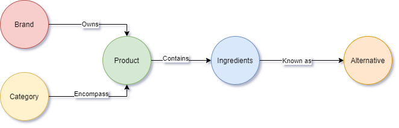

# Ingredients-found-in-packaged-foods-database
Repository for packaged foods ingredients database<br>
Create a Folder on your computer with the R script inside, this will <br>
be the location where the data will be downloaded and the csv's for the database generated.<br>
## Data Download
The following will automatically set your directory and load the necessary libraries.
```R
setwd(dirname(rstudioapi::getActiveDocumentContext()$path))
library(readr)
library(plyr)
library(dplyr)
library(stringr)
library(data.table)
```
The following will download the data
```R
download.file("https://static.openfoodfacts.org/data/en.openfoodfacts.org.products.csv", "OFF.csv")
download.file("https://fdc.nal.usda.gov/fdc-datasets/FoodData_Central_branded_food_csv_2019-12-17.zip", "FDC.zip")
download.file("https://www.dsld.nlm.nih.gov/dsld/downloads/all_lstIngredients_csv.zip", "DSDL.zip")
```
## Data Extraction
Read in the Data
```R
###Read in OFF Data###
OFF_data <- read_delim("OFF.csv", "\t", escape_double = FALSE, trim_ws = TRUE)

###Read in FDC Data###
FDC_data <- read.csv(unz("FDC.zip", "branded_food.csv"), header = TRUE, sep = ",")

###Read in DSDL Data###
DSDL_data <- read.csv(unz("DSDL.zip", "lstIngredients.csv"), header = TRUE, sep = ',', skip = 4)
```
Select the necessary data and limit the Open Food Facts data to only the United States
```R
###Select Colnums###
OFF_data <- subset(OFF_data, select = c(1, 8, 13, 15, 34, 35))
###We limit Data to united states for compatability###
OFF_data <- subset(OFF_data, countries_en == "United States")
OFF_data <- subset(OFF_data, select = -c(5))
FDC_data <- subset(FDC_data, select = c(3, 4, 2, 8))
```
## Data Formatting
Make the Data for the Open Food Facts and Food Data central all lowercase
```R
###Make all text lowercase###
OFF_data$product_name <- tolower(OFF_data$product_name)
OFF_data$brands <- tolower(OFF_data$brands)
OFF_data$categories <- tolower(OFF_data$categories)
OFF_data$ingredients_text <- tolower(OFF_data$ingredients_text)
FDC_data$ingredients <- tolower(FDC_data$ingredients)
FDC_data$brand_owner <- tolower(FDC_data$brand_owner)
FDC_data$branded_food_category <- tolower(FDC_data$branded_food_category)
```
## Data Merging
Merge the Open Food Facts Dataset with the Food Data Central Dataset 
```R
#####Merge OpenFoodFacts Data with FoodDataCentral Data#####
OFF_data = rename(OFF_data, c("ingredients" = "ingredients_text"))
FDC_data = rename(FDC_data, c("code"="gtin_upc", "brands" = "brand_owner", "categories" = "branded_food_category"))
OFF_Data_Temp <- subset(OFF_data, select = c(1, 2))
OFF_data <- subset(OFF_data, select = c(1, 5, 3, 4))
all_Data <- merge(FDC_data, OFF_data, by=c('code'), all.x = T)

###Replace all blanks with NA###
all_Data[all_Data=='']<-NA

###merge both ingredient colnums with FDC taking priority and overwritting NA when possible
all_Data$ingredients <- ifelse(is.na(all_Data$ingredients.x), all_Data$ingredients.y, all_Data$ingredients.x)
all_Data <- subset(all_Data, select = c(1, 8, 3, 4, 6, 7))

###merge both band colnums same as ingredients
all_Data$brands <- ifelse(is.na(all_Data$brands.x), all_Data$brands.y, all_Data$brands.x)
all_Data <- subset(all_Data, select = c(1, 2, 7, 4, 6))

###merge both category colnums same as ingredients
all_Data$category <- ifelse(is.na(all_Data$categories.x), all_Data$categories.y, all_Data$categories.x)
all_Data <- subset(all_Data, select = c(1, 2, 3, 6))
all_Data$ingredients <- gsub('ingredients: ', '', all_Data$ingredients)

###merge products name back to total data###
all_Data <- merge(all_Data, OFF_Data_Temp, by=c('code'), all.x = T)
```
Strip the Dietary Supplement Label dataset and save only the necessary rows to match alternative names for ingredients
```R
DSDL_data <- subset(DSDL_data, select = c(1, 3))
DSDL_data <- DSDL_data %>% rename("Alt_names" = "Different.spelling.or.synonyms...for.Primary.Ingredient.Group.ID..GRP_ID.")
DSDL_data[DSDL_data=='']<-NA
DSDL_data <- na.omit(DSDL_data)
```
Limit the alternative names to only the top allergens
```R
####reduce the DSDL data to terms associated with the top 8 allergens####
# Milk, Eggs, Fish, shellfish, Tree Nuts, Peanuts, Wheat, soy

test_DSDL <- DSDL_data[grep("\"MILK\"", DSDL_data$Alt_names),]
test_DSDL$Ingredient.Name <- "MILK"
all_DSDL_Data <- test_DSDL[!duplicated(test_DSDL$Alt_names),]
test_DSDL <- DSDL_data[grep("\"PEANUT\"", DSDL_data$Alt_names),]
test_DSDL$Ingredient.Name <- "PEANUT"
test_DSDL <- test_DSDL[!duplicated(test_DSDL$Alt_names),]
all_DSDL_Data <- rbind(all_DSDL_Data, test_DSDL)
# FIsh and shellfish fell into the same category
test_DSDL <- DSDL_data[grep("\"FISH\"", DSDL_data$Alt_names),]
test_DSDL$Ingredient.Name <- "FISH"
test_DSDL <- test_DSDL[!duplicated(test_DSDL$Alt_names),]
all_DSDL_Data <- rbind(all_DSDL_Data, test_DSDL)

test_DSDL <- DSDL_data[grep("\"SHELLFISH\"", DSDL_data$Alt_names),]
test_DSDL$Ingredient.Name <- "SHELLFISH"
test_DSDL <- test_DSDL[!duplicated(test_DSDL$Alt_names),]
all_DSDL_Data <- rbind(all_DSDL_Data, test_DSDL)

test_DSDL <- DSDL_data[grep("\"EGG\"", DSDL_data$Alt_names),]
test_DSDL$Ingredient.Name <- "EGG"
test_DSDL <- test_DSDL[!duplicated(test_DSDL$Alt_names),]
all_DSDL_Data <- rbind(all_DSDL_Data, test_DSDL)

test_DSDL <- DSDL_data[grep("\"WHEAT\"", DSDL_data$Alt_names),]
test_DSDL$Ingredient.Name <- "WHEAT"
test_DSDL <- test_DSDL[!duplicated(test_DSDL$Alt_names),]
all_DSDL_Data <- rbind(all_DSDL_Data, test_DSDL)

test_DSDL <- DSDL_data[grep("\"SOY\"", DSDL_data$Alt_names),]
test_DSDL$Ingredient.Name <- "SOY"
test_DSDL <- test_DSDL[!duplicated(test_DSDL$Alt_names),]
all_DSDL_Data <- rbind(all_DSDL_Data, test_DSDL)
# Tree nutsd have too many names to fall into the term TREE NUT therefor I will take common tree nuts
test_DSDL <- DSDL_data[grep("\"CASHEWS\"", DSDL_data$Alt_names),]
test_DSDL$Ingredient.Name <- "CASHEWS"
test_DSDL <- test_DSDL[!duplicated(test_DSDL$Alt_names),]
all_DSDL_Data <- rbind(all_DSDL_Data, test_DSDL)
test_DSDL <- DSDL_data[grep("\"ALMONDS\"", DSDL_data$Alt_names),]
test_DSDL$Ingredient.Name <- "ALMONDS"
test_DSDL <- test_DSDL[!duplicated(test_DSDL$Alt_names),]
all_DSDL_Data <- rbind(all_DSDL_Data, test_DSDL)
test_DSDL <- DSDL_data[grep("\"HAZELNUTS\"", DSDL_data$Alt_names),]
test_DSDL$Ingredient.Name <- "HAZELNUTS"
test_DSDL <- test_DSDL[!duplicated(test_DSDL$Alt_names),]
all_DSDL_Data <- rbind(all_DSDL_Data, test_DSDL)
```
Format the DSDL dataset
```R
all_DSDL_Data$Ingredient.Name <- tolower(all_DSDL_Data$Ingredient.Name)
all_DSDL_Data$Alt_names <- tolower(all_DSDL_Data$Alt_names)
```
## Data Cleaning
Remove any NA's from the Data to ensure complete population
```R
all_Data <- na.omit(all_Data)
```
Merge the alternative allergen ingredient names to the complete data based on if the ingredient exist within the ingredient list.
```R
DSDL_alt_name <- aggregate(x=all_DSDL_Data[c("Alt_names")], by=list(name=all_DSDL_Data$Ingredient.Name), min, na.rm = TRUE)
all_Data$alt_almonds <- ifelse(grepl("almonds", all_Data$ingredients, ignore.case = T), DSDL_alt_name$Alt_names[1], "")
all_Data$alt_cashews <- ifelse(grepl("cashews", all_Data$ingredients, ignore.case = T), DSDL_alt_name$Alt_names[2], "")
all_Data$alt_egg <- ifelse(grepl("egg", all_Data$ingredients, ignore.case = T), DSDL_alt_name$Alt_names[3], "")
all_Data$alt_fish <- ifelse(grepl("fish", all_Data$ingredients, ignore.case = T), DSDL_alt_name$Alt_names[4], "")
all_Data$alt_hazelnuts <- ifelse(grepl("hazelnuts", all_Data$ingredients, ignore.case = T), DSDL_alt_name$Alt_names[5], "")
all_Data$alt_milk <- ifelse(grepl("milk", all_Data$ingredients, ignore.case = T), DSDL_alt_name$Alt_names[6], "")
all_Data$alt_peanut <- ifelse(grepl("peanut", all_Data$ingredients, ignore.case = T), DSDL_alt_name$Alt_names[7], "")
all_Data$alt_shellfish <- ifelse(grepl("shellfish", all_Data$ingredients, ignore.case = T), DSDL_alt_name$Alt_names[8], "")
all_Data$alt_soy <- ifelse(grepl("soy", all_Data$ingredients, ignore.case = T), DSDL_alt_name$Alt_names[9], "")
all_Data$alt_wheat <- ifelse(grepl("wheat", all_Data$ingredients, ignore.case = T), DSDL_alt_name$Alt_names[10], "")
```
## Data Export
Export to a csv which will be called all_data.csv
```R
write.csv(all_Data, "all_data.csv", row.names = TRUE)
```
Move the generated csv file to the import folder for your database in Neo4j

## Database Creation

The following cypher queries will establish nodes and their relationshps within the database
1. Create the nodes
```cql
:auto USING PERIODIC COMMIT 1000 LOAD csv with headers from "file:///all_data.csv" as row 
merge (i:ingredients{ingredient_text:row.ingredients})
merge (b:brands{brand_text:row.brands})
merge (c:category{category_text:row.category})
merge (p:product{product_text:row.product_name, code:row.code}) 
merge (a:alternative{almonds:row.alt_almonds, cashews:row.alt_cashews, egg:row.alt_egg, fish:row.alt_fish, hazelnut:row.alt_hazelnuts, milk:row.alt_milk, peanut:row.alt_peanut, shellfish:row.alt_shellfish, soy:row.alt_soy, wheat:row.alt_wheat})
```
2. Build the relationship between the UPC and product name, count returned 5975 on 4/15/2020
```cql
:auto USING PERIODIC COMMIT 1000
LOAD csv with headers from "file:///all_data.csv" as row
match (p:product{product_text:row.product_name, code:row.code})
match (i:ingredients{ingredient_text:row.ingredients})
merge (p)-[r:contain]->(i)
return count(*)
```
3. Build the relationship between the product name and brand, count returned 5975 on 4/15/2020
```cql
:auto USING PERIODIC COMMIT 1000
LOAD csv with headers from "file:///all_data.csv" as row
match (p:product{product_text:row.product_name, code:row.code})
match (b:brands{brand_text:row.brands})
merge (b)-[r:owns]->(p)
return count(*)
```
4. Build the relationship between the product name and category, count returned 5975 on 4/15/2020
```cql
:auto USING PERIODIC COMMIT 1000
LOAD csv with headers from "file:///all_data.csv" as row
match (p:product{product_text:row.product_name, code:row.code})
match (c:category{category_text:row.category})
merge (c)-[r:encompass]->(p)
return count(*)
```
5. Build the relationship between the ingredients and alternative allergen names, count returned 5975 on 4/15/2020
```cql
:auto USING PERIODIC COMMIT 1000
LOAD csv with headers from "file:///all_data.csv" as row
match (a:alternative{almonds:row.alt_almonds, cashews:row.alt_cashews, egg:row.alt_egg, fish:row.alt_fish, hazelnut:row.alt_hazelnuts, milk:row.alt_milk, peanut:row.alt_peanut, shellfish:row.alt_shellfish, soy:row.alt_soy, wheat:row.alt_wheat})
match (i:ingredients{ingredient_text:row.ingredients})
merge (i)-[r:known_as]->(a)
return count(*)
```
## Database Relationships

